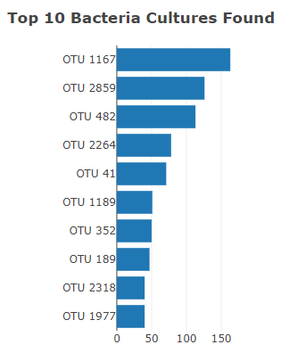
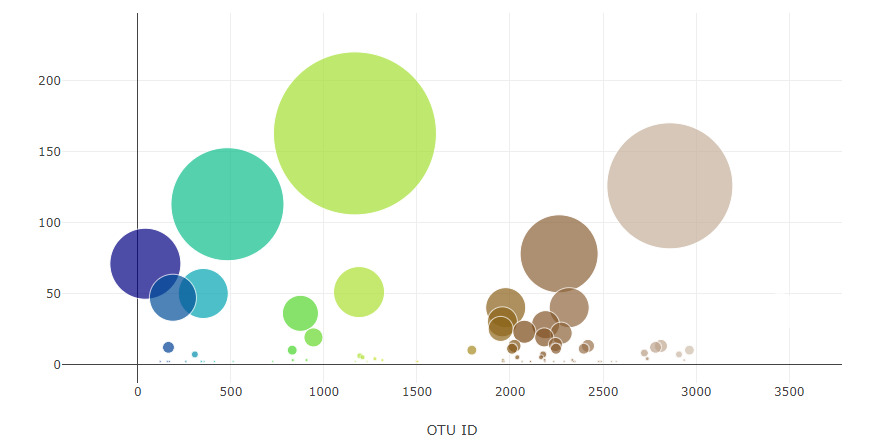
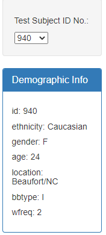
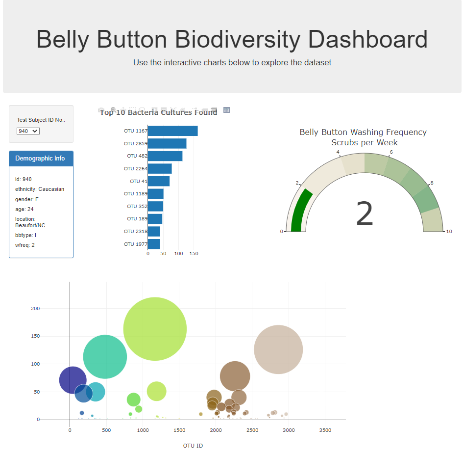

# belly-button-challenge
Module 14 Challenge

# Belly Button Biodiversity Dashboard

### Deployed website:
https://gilev0.github.io/belly-button-challenge

In this project we built an interactive dashboard to explore the [Belly Button Biodiversity dataset](http://robdunnlab.com/projects/belly-button-biodiversity/). 

## Overview

I used the D3 library to read in `samples.json` then created a horizontal bar chart with a dropdown menu to display the top 10 OTUs found in that individual. Then used sample_values` as the values for the bar chart.  Next I used `otu_ids` as the labels for the bar chart and `otu_labels` as the hovertext for the chart. 

`

I then created a bubble chart displaying each sample, using `otu_ids` for the x values, `sample_values` for the y values, `sample_values` for the marker size, `otu_ids` for the marker colors, and `otu_labels` for the text values.

I displayed the sample metadata (an individual's demographic information), then displayed each key-value pair from the metadata JSON object.

## Advanced Challenge Assignment
Adapt the Gauge Chart from https://plot.ly/javascript/gauge-charts/ to plot the weekly washing frequency of the individual.

## Hints
- Use console.log inside of your JavaScript code to see what your data looks like at each step.

- Refer to the [Plotly.js documentation](https://plotly.com/javascript/) when building the plots.

The final result:  

## Resources used
- Data Source: <a href="https://2u-data-curriculum-team.s3.amazonaws.com/dataviz-classroom/v1.1/14-Interactive-Web-Visualizations/02-Homework/samples.json" target="_blank">Bellybutton Samples</a>
- Software: Visual Studio 
- HTML code: <a href="https://github.com/GILEV0/belly-button-challenge/index.html" target="_blank">index.html</a>
- JavaScript code:  <a href="https://github.com/GILEV0/belly-button-challenge/static/js/app.js" target="_blank">app.js</a>
